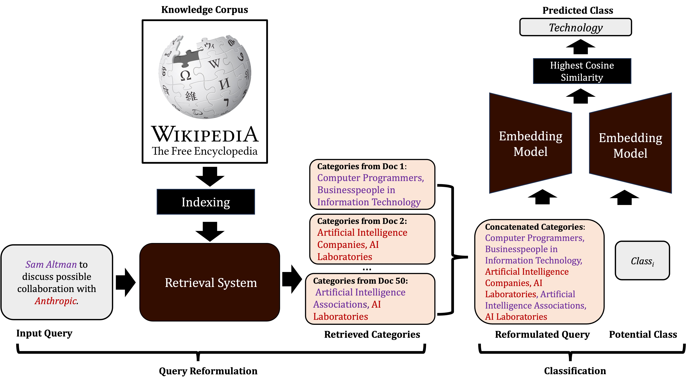

# Retrieval Augmented Zero-Shot Text Classification (QZero)
## Description

We introduce QZero, a novel training-free approach that reformulates queries by retrieving supporting categories from Wikipedia to improve zero-shot classification performance. Our experiments across six diverse datasets demonstrate that QZero enhances performance for state-of-the-art static and contextual embedding models without the need for retraining. Notably, in News and medical topic classification tasks, QZero improves the performance of even the largest OpenAI embedding model by at least 5% and 3%, respectively. Acting as a knowledge amplifier, QZero enables small word embedding models to achieve performance levels comparable to those of larger contextual models, leading to significant computational savings. Additionally, QZero offers meaningful insights that illuminate query context and verify topic relevance, aiding in understanding model predictions. Overall, QZero improves embedding-based zero-shot classifiers while maintaining their simplicity. This makes it particularly valuable for resource-constrained environments and domains with constantly evolving information. The figure below describes the entire Zero-shot classification process

